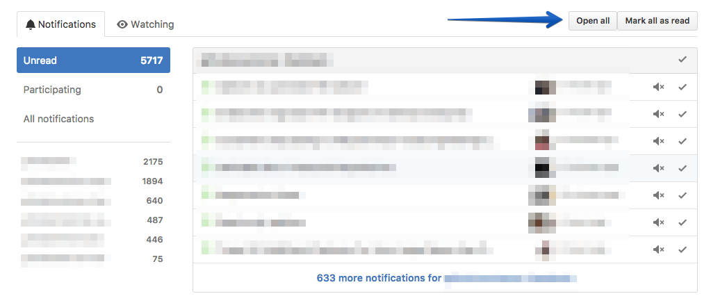

# GitHub Open All Notifications

This chrome extension adds an `Open All` button in GitHub's notifications view which when pressed will open all unread notifications in a new Chrome tab and mark them as read.

## Installation

Simply install the extension directly from the Chrome Store:

## Known limitation

The button only appears on page load. If a user clicks the notification button on the left hand side of the screen that will (re)load the notification views using PJAX, and as such the page load event won't trigger adding the button back again. I usually simply refresh the page. I hope to make the button appear based on the rendering events and not the page load event.

## Contributing

Pull requests are welcome as well as issues reporting problems or providing feedback.

The extension is extremely simple and as such it doesn't include a package manager and/or build tool. To develop the extension simply clone the repository and load the unpacked extensions directly into Google Chrome.

:octocat::heart:
